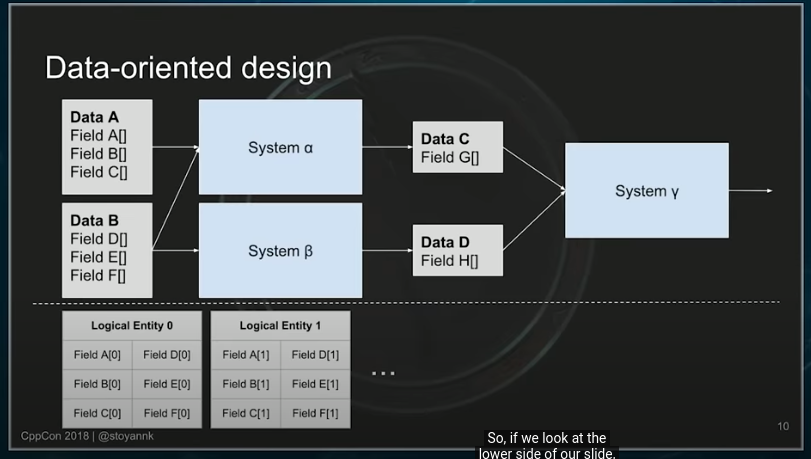

# Overview
## CppCon
Notes that came out of [OOP is DED, Long Live Data-oriented Design](https://www.youtube.com/watch?v=yy8jQgmhbAU).
### Agenda
Overview of topics
- Basic Issue with OOP
- Basics of Data-oriented design
- Problem Definition
- Object oriented programming approach
- Data-oriented design approach
- Results & Analysis

### OOP Marries Data with Operations (Behavior)
It mixes abstractions (interfaces) with Heterogeneous Data that is public.

### Data Oriented Design - Gist

- Seperates logic from data
- exposes all data
- avoids hidden states
- no virtual calls
- promotes domain knowledge

## The State

Checking the state of the animation object. It is allocated on heap
```
if (!timeline_) {
  return false;
}
...
if (content_) {

}
```

### UPdating Time and Values
```
if (event_delegate_) {
  event_delegate_->OnEventCondition(*this);
}

...

if (needs_update) {
  UpdateChildrenAndEffects();
}
```
Animations have to call event. We brought coupling between animatin and event system. No 

### Interpolate different type values
```c++
class Interpolation {
  virtual Interpolate();
}
```
Dynamic Type Erasure