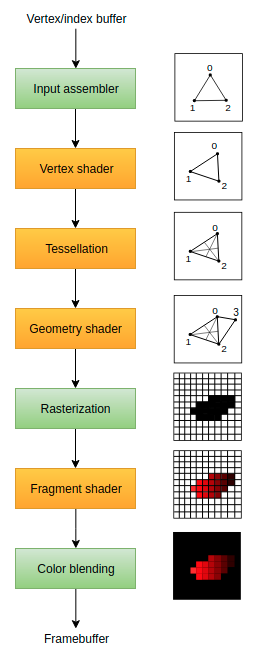

# Introduction
The graphics pipeline is the sequence of operations that take the vertices and textures of your meshes all the way to the pixels in the render targets.


| Stage | Type | Description |
| ----- | ---- | :---------- |
| Input Assembler | Fixed-Function | Collects the raw vertex data from the buffers specified. iUse an index buffer to repeat certain elements without having to duplicate vertex data itself. |
| Vertex Shader | Programable | Vertex Shader ios run for every vertex and applies a transformation to turn vertex positions from model space to screen space. |
| Tesselation | Programable | Subdivide geometry based on certain rules to increase the mesh quality. Make surefaces like brick walls and staircases look less flat when nearby. |
| Geometry Shader | Programable | Run on primitive (triangle, line, point) and can discard it or output more primitives than came in. Similiar to tesselation shader but more flexible. However, it is not performanitive on most graphics cards except for Intels integrrated GPUs.|
| Rasterization | Fixed-Function | Descretizes primitives into fragments. These are the pixel elements that they fill on framebuffer. Only those that are on screen or in forground are rendered and others are discarded. |
| Fragment Shader | Programable | Invoked on fragments that survive and dtermine which framebuffers the fragments are written to. Which color and depth values are applied. It can do this using interpolated data from vertex shader including things like texture coordinates and normals for lighting. |
| Color Blending | Fixed-Function | Applies operations to mix different fragments that map to the same pixel in the framebuffer. Can overwrite or add up based on transparency. |

| Stage Type | Description |
| ---------- | :---------- |
| Fixed Function | Allow you to tweak their operations using parameters but are predefined in functionality |
| Programmable | You upload your own code to the graphics card to apply exacly the operations you want. (e.g, Fragment Shaders, texuring, lighting, ray tracers) |

Graphics pipelines are almost completely immutable so you must recreate pipeline if you want to:
- change shaders,
- bind different framebuffers
- change blend function

### Disadvantage:
- need to create a # of pipelies that represent all combinations of states you want to use in your rendering ops.

### Advantages:
- you know operations in advance so the driver can optimize for it much better.

### Optional Stages:
- Tesselation & Geoemtry for simple drawings
- Fragement shader if only interested in depth values (shadow map generation)


# Shader Modules
## SPIR-V
Vulkan uses SPIR-V bytecode format instead of GLSL and HLSL.

The bytecode removes the syntax errors or undefined behavior that comes from non-trivial shaders due to the interaction with vendor's drivers.

Khronos has released their own compiler for GLSL to SPIR-V. We will use `glslc.exe` from Google.

`Main` function is invoked for every object. Global variables handline input and output.
## Vertex Shader
Process each incoming vertex. Takes in attributes like:
- world position
- color
- normal coordinates
- text coordinates

Output is final positino in clip coordinates and attributes to be passed on to **fragement shader**. These values are then interpolated over the fragements by the reasterizer to produce a smooth gradient.

**Clip Coordinate** is a four dimensional vector from the vertex shader that is turned into a normalized device coordinate by dividing the whole vector by its last component.

## Vertex Buffers
The coordinates for these shaders are stored ion a vertex buffer.

## Fragment Shaders
The triangle (that is formed by the positions from the vertex shader) fills an area on the screen with fragments. The fragment shader is invoked on these fragments to produce a color and depth for the framebuffer.

## Per Vertex Color
The input variable does not necessarily have to use the same name, they will be linked together using the indexes specified by the location directives.

## Compilation
```bash
/home/user/VulkanSDK/x.x.x.x/x86_64/bin/glslc shader.vert -o vert.spv
/home/user/VulkanSDK/x.x.x.x/x86_64/bin/glslc shader.frag -o frag.spv
```

## Loading a Shader
```c++
static std::vector<char> readFile(const std::string& filename) {
    std::ifstream file(filename, std::ios::ate | std::ios::binary);

    if (!file.is_open()) {
        throw std::runtime_error("failed to open file!");
    }
}
```
Reading from end of file we can allocate a buffer from reading the position of the file to determine the size.
```c++
size_t fileSize = (size_t) file.tellg();
std::vector<char> buffer(fileSize);
```

After we seek to begining to read all bytes at once.
```c++
file.seekg(0);
file.read(buffer.data(), fileSize);
```


## Creating a shader module
Need to wrap tbe byte code tin a `VkShaderMOdule` object.

need to cast the char pointer to a `uint32_t*` with `reinterpret_cast`

## Shader Stage Creation
To use the shaders we need to assign them to a specific stage.
`VkPipelineShaderStageCreateInfo`

# Fixed Functions

## Vertex Input
`VkPipelineVertexInputStateCreateInfo` structure describes the format of the vertex data that will be passed to the vertex shader.

## Input Assembly
`VkPipelineInputAssemblyStateCreateInfo` describes two things:
1. What kind of geometry will be drawn from the vertices
2. If primite restarted should be enabled.

Normally the vertices are loaded from the vertex buffer by index in sequential order.

With an **elment buffer** you can specify the indices to load yourself. Allows reusing vertices.

## Viewport and Scissors

`VkViewport` describes region of framebuffer that the output will be rendered to.

`VkRect2D` (scissors) describe the region in which pixels will be stored.

## Rasterizer
The rasterizer takes gemortry that is shaped by the vertices from the vertex shader and turns it into fragments to be colored by the fragement shader.

- Depth testing
- face culling
- scissor test.

## Multisampling
One way to perform ati-aliasing.

It combines the fragment shader results of multiple polygons that rasterize to the ame pixel. This mainly occurs along edges

## Color Blending
After a fragment shader has returned color it needs to be combined with the color that is already in the framebuffer.

Methods:
- Mix the old and new value to produce a final color.
- combine new and old value using bitwise operation.

| Struct | Description|
| ------ | :--------- |
| `VkPipelineColorBlendAttachmentState` | Configuration per attached framebuffer |
| `VkPipelineColorBlendStateCreateInfo` | Global color blending settings. |

## Dynamic State
You need to provide a dynamic state create info for all dynatimc states that want to be changed without recreating the pipeline.

`VkPipelineDynamicStateCreateInfo`

## Pipeline Layout
`VkPipelineLayout` uniform values to be specified during pipeline creatino by creating a `VkPipelineLayout` object.

# Render Passes

## Attachment Descriptions

## SUbpasses and attachement references

## Render Pass